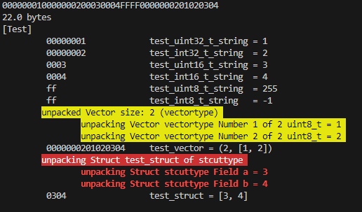

# parse-hex-string
python hex string parser


```python
python parse_hex_string.py stream.txt
```

output:



hex string stream input:
```:stream.txt
000000010000000200030004FFFF
000000020102   #vector
0304           #struct
```

format in python:
```python
    FMT = [
        "Test",
        ">>INDENT<<",
        Item("test_uint32_t_string",    Uint32_t),
        Item("test_int32_t_string ",     Int32_t),
        Item("test_uint16_t_string",    Uint16_t),
        Item("test_int16_t_string ",     Int16_t),
        Item("test_uint8_t_string ",     Uint8_t),
        Item("test_int8_t_string  ",      Int8_t),
        Item("test_vector",    Vector("vectortype", Uint8_t)),
        Item("test_struct",    Struct("stcuttype", [
            Item("a",    Uint8_t),
            Item("b",    Uint8_t),
        ])),
        ">>UNINDENT<<",
    ]
```
